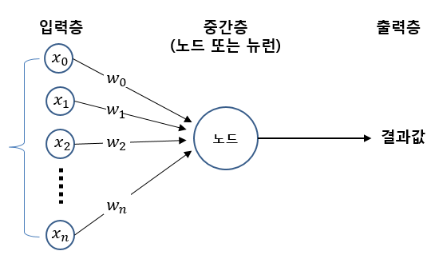

# 퍼셉트론 (Percenptron)
> 퍼셉트론 알고리즘은 인공 신경망의 가장 기본적인 형태로, **여러 입력값에 가중치를 곱하고 합산한 뒤 임계값(Threshold)을 기준으로 출력**을 결정하는 모델이다.  
> 입력(Input) → 가중치(Weight) → 가중합(Summation) → 임계값(Threshold) → 출력(Output)  

  
 

** Formula **  
> y = if ∑(wi​⋅xi​) + b ≥ 0 : 1  
> y = otherwise : 0  
>> xi : 입력값 (진리표의 0 또는 1)  
>> wi : 가중치  
>> b : 바이어스 (임계값을 조정하는 역할)  
>> y : 출력값  
 
 

### 1. AND 게이트 진리표
| **x1** | **x2** | **x1 AND x2** |
|:---:|:---:|:---:|
| 0| 0| 0|
| 1| 0| 0|
| 0| 1| 0|
| 1| 1| 1|
- 모든 입력이 1일 때만 출력이 1 = (1,1) 일 때만 출력이 1  
> 예시 파라미터 : w1 = 0.5, w2 = 0.5, b = -0.7  
>> (1,1) → 0.5*1 + 0.5*1 - 0.7 = 0.3 ≥ 0  
>>> ∴ y = 0  
 

### 2. NAND 게이트 진리표
| **x1** | **x2** | **x1 NAND x2** |
|:---:|:---:|:---:|
| 0| 0| 1|
| 1| 0| 1|
| 0| 1| 1|
| 1| 1| 0|
- AND게이트의 반대를 출력 = (1,1) 일 때만 출력이 0  
- 가중치와 바이어스의 부호를 반대로 바꾸어, AND게이트의 반대이므로 출력을 뒤집었다.  
> 예시 파라미터 : w1 = -0.5, w2 = -0.5, b = 0.7  
>> (1,1) → -0.5*1 + -0.5*1 + 0.7 = -0.3 < 0  
>>> ∴ y = 0, 나머지 경우는 y = 1  
 

### 3. OR 게이트 진리표
| **x1** | **x2** | **x1 NAND x2** |
|:---:|:---:|:---:|
| 0| 0| 0|
| 1| 0| 1|
| 0| 1| 1|
| 1| 1| 1|
- 입력 중 하나라도 1이면 출력이 1  
> 예시 파라미터 : w1 = 0.5, w2 = 0.5, b = -0.2  
>> (0,0) → 0.5*0 + 0.5*0 - 0.2 = -0.2 < 0  
>>> ∴ y = 0  
>> (1,0) → 0.5*1 + 0.5*0 - 0.2 = 0.3 ≥ 0  
>>> ∴ y = 1  
>> (0,1) → 0.5*0 + 0.5*1 - 0.2 = 0.3 ≥ 0  
>>> ∴ y = 1  
>> (1,1) → 0.5*1 + 0.5*1 - 0.2 = 0.8 ≥ 0  
>>> ∴ y = 1  
 
 

### 🚨 퍼셉트론의 한계  
- XOR 게이트는 단일 퍼셉트론으로는 구현할 수 없다. XOR은 선형 분리(linearly separable)가 되지 않기 때문이다.  
- XOR을 표현하려면 다층 퍼셉트론(Multi-Layer Perceptron, MLP) 구조가 필요하다.  

### ✅ 정리  
- 퍼셉트론은 단순한 가중치와 임계값 조정만으로 AND, NAND, OR 게이트를 구현할 수 있다.  
- 하지만 XOR처럼 선형적으로 분리되지 않는 문제는 단일 퍼셉트론으로는 해결할 수 없다.  